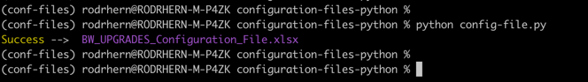
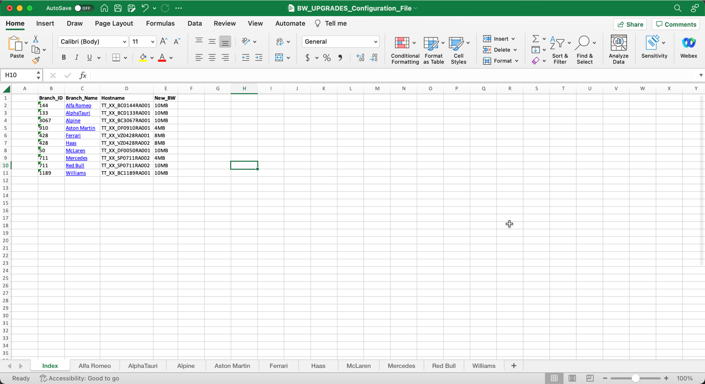
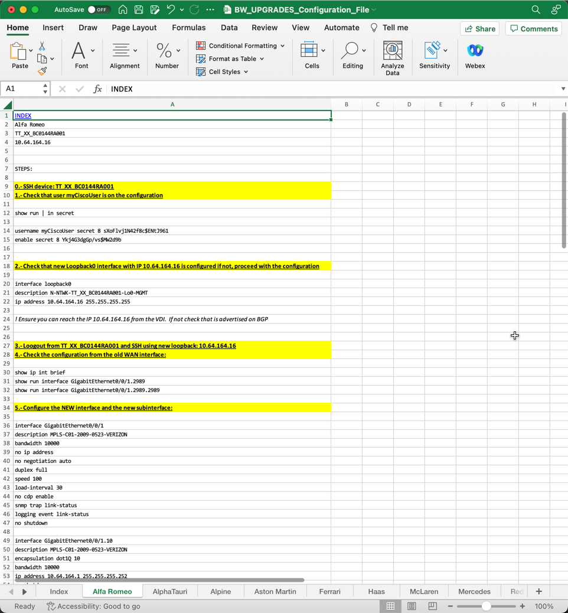

# Generate Implementation Plans

Create your own excel implementation file using data from a CSV file. 

[CSV file](./source_data.csv)


## Pre-Requisites
You must have **Python3** and **pip3** installed. 
Once is done, clone this repository


## Install python dependencies
1. Open a CMD/Powershell/terminal console and move it folder `configuration-files-python`
2. Install the python dependencias that are in _requirements.txt_ file. You can use:
```
pip intall -r requirements.txt
````
## Running the script
1. Use the next command to run the script:
```
python config-file.py
```






